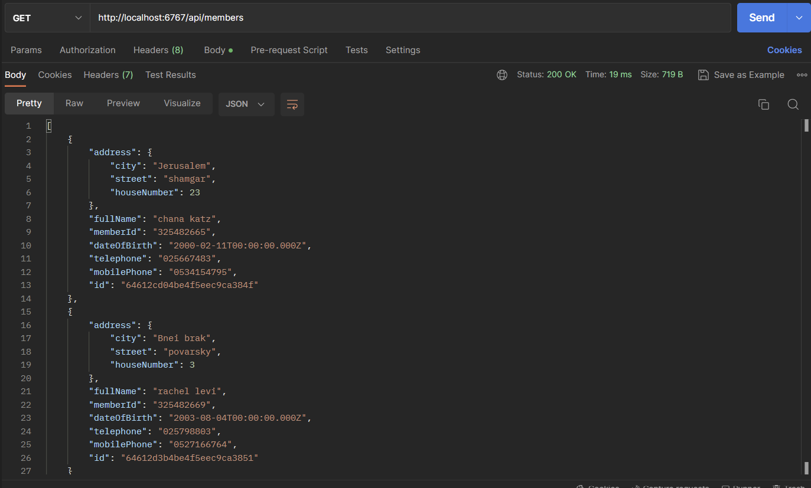
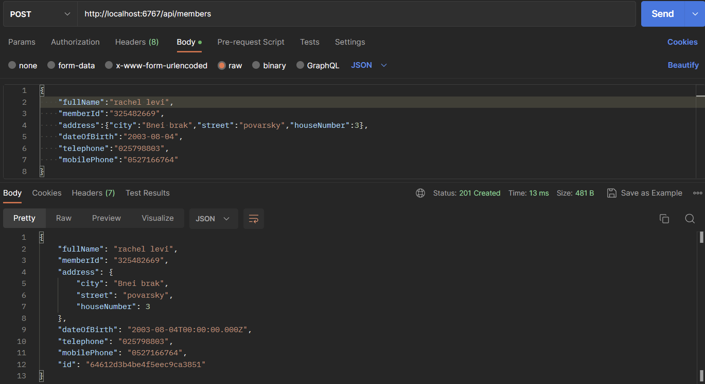
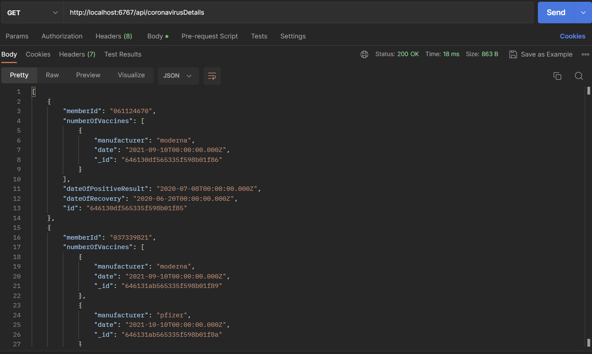
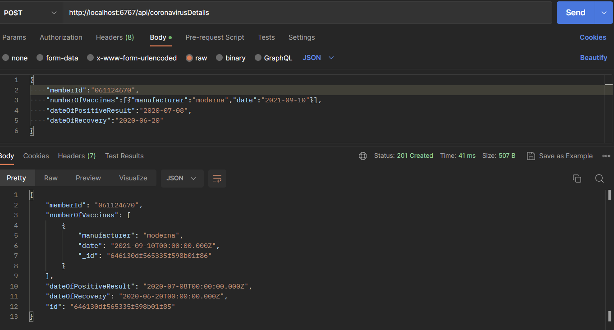

# Languages:
    Node.js
    mongoDB

# Installation:
    npm init
    npm i express
    npm i body-parser
    npm i mongoose

# Begin:
    npm start

# Postman:
    url- members: "http://localhost:6767/api/members"
    url- coronavirusDetails: "http://localhost:6767/api/coronavirusDetails"
    
# Screenshots:

get members:

add new member:

get coronavirusDetails:

add new coronavirusDetails:

